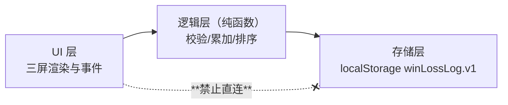

# Architecture Spine（架构主干）

> ≤300 行纪律 · 2026-07-31 · 随架构变更 PR 同步更新

## 系统边界

**做**：本机浏览器内记录与查看赌场输赢（3 步：记一笔/看流水/看汇总）。
**不做**：账号、同步、后端、多设备、导出、分类（见 PRD Won't-have）。
**外部依赖**：零。不联网、不加载任何外部资源。

## 核心组件

全部三层内联于单个 HTML 文件，以注释区块分隔。

## 关键约束

| 约束 | 出处 |
|---|---|
| 单文件、无外链、无构建 | ADR-001 · SPEC-9 |
| 金额只收整数（赌场无分） | PRD SR-2（用户领域裁决） |
| 单文件 ≤400 行 | NFR-3 fitness function |
| UI 层不得直接访问 localStorage | plan 依赖方向断言 |
| 存储键 `winLossLog.v1`，改键须新 ADR | SPEC-2 |

## 已知债务（如实记录，不粉饰）

- **数据可能丢失**：localStorage 遇清缓存/换浏览器即失。已在 prfaq FAQ 明确接受；导出功能在 backlog，非本次范围（ADR-001 后果段）
- **无自动化浏览器测试**：逻辑层有纯函数测试，UI 层靠人工验证——3 步骨架规模下接受
