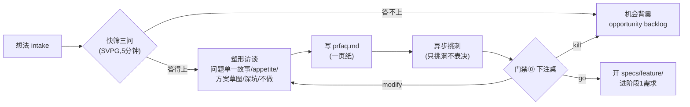

# 阶段 0 定义：战略/立项（Discovery & Betting）

> 阶段定义包 v1 · 2026-07-30 · 本文档是"每阶段五件套"的模板首例（定义/制品/目录/名词/skill 规格）
> 参考标准：Shape Up Pitch 五要素、SVPG 机会评估 10 问、SAFe Lean Business Case、GOV.UK Discovery、Amazon PR-FAQ（出处见《E2E研发平台-完整报告》与阶段0调研对照表）

## 0. 方法论 MECE 全景（立项决策的完整维度分解）

> 分解原则：按"立项必须回答的决策问题"切维度（天然互斥）；穷尽性用 Cagan 四风险（Value/Usability/Feasibility/Viability）+ 八流派字段对表检验——任何流派的任何字段都能唯一归入 D1-D7，无遗漏无重叠。

| # | 决策问题（互斥） | 覆盖它的方法论 | 本平台采纳 | 归属 |
|---|---|---|---|---|
| D1 | **该不该做**（价值/需求真伪，Cagan Value risk） | SVPG 三问 · Amazon PR-FAQ · JTBD | 假设陈述 + 客户痛点（单一具体故事） | 阶段0 |
| D2 | **为什么是我们、为什么是现在**（市场/时机，Viability 之一） | SVPG 10 问 Q4-7 · [Stage-Gate 战略契合 must-meet](https://www.viima.com/blog/guide-to-phase-gate-process) | 差异化主张（含 why-now） | 阶段0 |
| D3 | **做不做得成**（可行性/已知险坑，Cagan Feasibility） | Shape Up 方案草图+Rabbit Holes | 方案草图 + 深坑（已知坑+绕行） | 阶段0 粗判；细化归阶段2/3 |
| D4 | **投多少、排不排得上**（投入/优先级，Viability 之二） | Shape Up Appetite · SAFe WSJF · [Stage-Gate 计分卡](https://www.wellspring.com/blog/how-to-manage-your-innovation-process-the-stage-gate-framework) | Appetite+熔断+砍序；多想法竞争由下注桌裁（单人场景不引 WSJF，避免过度流程） | 阶段0 |
| D5 | **最险的假设是什么、怎么最便宜地证伪**（风险验证策略） | [Lean Startup RAT](https://modelthinkers.com/mental-model/riskiest-assumption-test)（leap-of-faith assumption）· GOV.UK 知识缺口 | prfaq「最险假设」字段：假设 + 最便宜验证方式 | 阶段0 定义；验证可延至观察窗 |
| D6 | **谁拍板、怎么退出**（治理，Viability 之三） | Stage-Gate [must/should-meet 双层判据](https://www.viima.com/blog/guide-to-phase-gate-process) · Shape Up 下注桌 · PMI phase-gate | 门禁⓪ go/modify/kill + 分层判据（熔断线=must-meet；观察窗信号=should-meet）+ 机会背囊 | 阶段0 |
| D7 | **用户用不用得好**（Cagan Usability risk） | GV Design Sprint · 原型测试 | **显式移交**：阶段1（PRD 验收标准）/ 阶段2（spec 原型验证）——阶段0 不管但登记进知识缺口 | 移交（保穷尽不漏） |

**MECE 检验记录**：互斥——D3（已知险坑怎么绕）与 D5（最不确定假设先证伪）以 known-unknowns / riskiest-unknown 划界；穷尽——Cagan 四风险映射 Value→D1、Feasibility→D3、Usability→D7、Viability→D2/D4/D6，八流派（Shape Up/SVPG/SAFe/GOV.UK/Amazon/Stage-Gate/Lean Startup/PMI）字段全部可归位，无孤儿字段。

## 1. 阶段卡（一屏说清）

| 项 | 内容 |
|---|---|
| 目的 | 在写任何代码之前回答：**这事值不值得做、投多少、坑在哪、什么不做** |
| 入口条件 | 有一个想法（任何来源：用户反馈/业务目标/事故回流/灵感） |
| 核心原则 | **只学习不建造**（GOV.UK）；多数想法应该死在这一段（Amazon：约 10 轮修订过滤掉大部分） |
| 主制品 | `specs/<feature>/prfaq.md`（融合模板，见 §3） |
| 可选制品 | `specs/<feature>/discovery-notes.md`（访谈记录/现有方案扫描/知识缺口——大 feature 才要） |
| 出口 = 门禁⓪ | **立项/下注**：go / modify / kill，批准人=产品/业务负责人；决定记录写进 prfaq 尾部门禁块 |
| 时限 | 快筛 5 分钟；塑形访谈 ≤2 次；prfaq 一页纸。**阶段0 拖长 = 该 kill 的信号** |
| 负责 skill | `e2e-discovery`（规格见 §5） |

## 2. 阶段内流程



- **快筛三问**（不过即止，防止阶段0 变成重流程）：① 解决什么问题？② 为谁解决？③ 怎么知道成功？
- **异步挑刺**：评论只为"戳洞/补信息"，不做 yes/no——表决只发生在门禁⓪（Shape Up 下注桌规则）
- **kill 是合法出口**：被 kill 的想法进机会背囊留档，不是失败

## 3. 主制品模板：prfaq.md（融合五标准）

```markdown
# PR-FAQ：<feature 名>
## 假设陈述          ← SAFe 句式：For [客户] who [痛点]，the [方案] is a [能力] that [价值]
## 未来新闻稿        ← Amazon：写给成功那天
## 客户与痛点        ← SVPG 三问之①②；问题必须有单一具体故事（Shape Up）
## 差异化主张        ← SVPG"为什么是我们/为什么是现在"
## 方案草图          ← Shape Up：粗到留空间、细到工程师能评估可行性（可选，简单 feature 并入新闻稿）
## Appetite          ← 投入上限+熔断规则+砍序（到期砍范围不展期）
## 深坑（Rabbit Holes）← Shape Up：已知技术/流程险坑，提前声明绕行方案
## 门禁⓪ go/kill 判据 ← 分层：熔断线（appetite 内可控）/ 后续 go 信号（观察窗）
## 不做什么（No-gos） ← 显式排除
## FAQ               ← 预答最尖锐的 3-5 问
## 门禁⓪ 记录        ← 批准人/决定(go|modify|kill)/日期/备注
```

## 4. 目录与命名约定

```text
specs/<feature>/
├── prfaq.md              # 阶段0 主制品（含门禁⓪记录块——门禁记录与制品同文件，审计不散落）
└── discovery-notes.md    # 可选：访谈记录/现有方案扫描/知识缺口（移交阶段1的输入）
docs/process/stages/stage-0-discovery.md   # 本文档（阶段定义，平台级唯一）
docs/glossary.md          # 名词表（阶段0词条见该文件 §阶段0）
```

- feature 命名：kebab-case 短语（如 `platform-pilot`、`gate-dashboard`）
- 机会背囊：`docs/process/opportunity-backlog.md`（被 kill/延迟的想法一行一条：想法/日期/原因/复活条件）

## 5. 执行 skill 规格：e2e-discovery（**已实现并实跑验证**）

> 实现位置：`.claude/skills/e2e-discovery/`（SKILL.md + templates/prfaq-template.md + scripts/check-prfaq.sh）
> 首次实跑：2026-07-30 对 `specs/platform-pilot/prfaq.md` 跑探针——第一轮即抓出模板/制品/探针三者"待批状态"写法不一致，修正后 PASS。SOP 与实现冲突时以本文档为准并回修 skill。
> 端到端验证跑（2026-07-30，经 Skill 机制正式触发）：四步全走——快筛三问从会话记录提取核对 3/3 过；塑形五字段核对**抓出语义缺口**（痛点为抽象罗列、缺 Shape Up"单一具体故事"，结构探针不可见）→ 按 SOP 单问补齐（用户确认故事属实）→ 探针 PASS → 自检清单 4/4 → 停门禁⓪。结论：SOP 可执行、能抓真问题、门禁停车行为正确。

- **触发**："立项 / 新想法 / 做个 X / e2e discovery"
- **流程**：快筛三问 →（不过→写入机会背囊并停）→ 塑形访谈（≤5 问/轮，≤2 轮：问题故事/appetite/深坑/no-gos）→ 生成 prfaq.md（§3 模板）→ 停在门禁⓪，**明确告知用户"等你 go/modify/kill"，绝不自行越门**
- **硬约束**：不写代码、不建目录之外的任何文件；modify 循环最多 2 次后建议 kill 或降级进背囊；kill 时自动登记机会背囊
- **验收**（对应 US-2 AC）：产出符合 §3 模板；门禁⓪未批时后续 skill（e2e-requirements）读不到批准记录即拒绝启动

## 6. 名词表（阶段0 词条，收录进 docs/glossary.md）

| 名词 | 定义 |
|---|---|
| PR-FAQ | 立项一页纸：未来新闻稿+FAQ（Amazon Working Backwards） |
| Appetite（胃口） | 投入上限承诺——不是工期估算而是约束：到期砍范围不展期（Shape Up） |
| 深坑 Rabbit Holes | 提前声明的高风险细节与绕行方案（Shape Up Pitch 第 4 要素） |
| No-gos | 显式排除项："这次明确不做的" |
| 假设陈述 | 一句式价值假设：For…who…the…is a…that…（SAFe Epic Hypothesis） |
| 快筛三问 | 什么问题/为谁/怎么算成功——5 分钟分诊（SVPG 机会评估核心三问） |
| 下注桌 Betting | 门禁⓪的表决时刻；此前所有评论只挑刺不表决（Shape Up） |
| go / modify / kill | 门禁⓪三种裁决（PMI phase-gate 判据形式） |
| 机会背囊 Opportunity Backlog | 被 kill/暂缓想法的留档处，含复活条件（SVPG） |
| 熔断 | appetite 到期强制收敛：砍范围保交付，不展期 |
| 观察窗 | 试点交付后收集市场侧 go 信号的时间窗（本平台扩展词条） |
| 知识缺口 | 阶段0 结束时"已知不知道"清单，移交阶段1（GOV.UK Discovery） |
