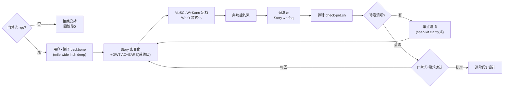

# 阶段 1 定义：产品发现/需求（Requirements）

> 阶段定义包 v1 · 2026-07-31 · 六件套：本定义 + prd 模板 + 目录约定 + 名词 + e2e-requirements skill + check-prd.sh 探针
> 参考标准：EARS（Rolls-Royce/Kiro 采用）· ISO/IEC/IEEE 29148 · Jeff Patton Story Mapping · INVEST · Kano · MoSCoW · Gherkin GWT · Definition of Ready · spec-kit specify/clarify

## 0. 方法论 MECE 全景（需求阶段的完整维度分解）

> 分解原则：按"PRD 必须回答的问题"切维度；穷尽性用 ISO 29148 质量特性（个体 9 项 + 集合级）+ 七流派字段对表检验。

| # | 决策问题（互斥） | 覆盖它的方法论 | 本平台采纳 | 归属 |
|---|---|---|---|---|
| R1 | **用户是谁、走什么路径**（全景骨架） | [Story Mapping](https://www.avion.io/what-is-user-story-mapping/) backbone（mile wide, inch deep）· persona · JTBD | PRD「用户与路径」段：角色×主路径 backbone，行走骨架标注 MVP 线 | 阶段1 |
| R2 | **要什么**（功能需求条目化） | User Story（As a…I want…so that）· [EARS 五句式](https://alistairmavin.com/ears/)（Ubiquitous/Event/State/Unwanted/Optional，系统级行为用）· INVEST | Story 为主体；系统级/hook 类行为用 EARS 句式（When/While/If…the system shall…） | 阶段1 |
| R3 | **好到什么程度**（可测验收） | Gherkin Given/When/Then · [ISO 29148](https://www.modernrequirements.com/blogs/iso-29148-explained/) verifiable/unambiguous/singular | 每条 Story 2-4 条 GWT AC；单条只测一事（singular） | 阶段1 |
| R4 | **不要什么、多好算够**（范围与优先级） | MoSCoW（含 **Won't-have 显式化**）· [Kano](https://productschool.com/blog/product-fundamentals/kano-model)（基本/绩效/惊喜——防"全是 Must"通胀） | MoSCoW 定档 + Kano 标注（基本型缺了即死/绩效型线性/惊喜型可砍） | 阶段1 |
| R5 | **非功能约束**（质量属性） | ISO 29148 NFR · 教科书 PRD 常漏项 | PRD「非功能需求」段：环境/性能/安全/合规/可维护，逐条可验证 | 阶段1 |
| R6 | **对不对得上**（追溯与一致性） | ISO 29148 traceable + 集合级 complete/consistent | 追溯表：Story ↔ prfaq 假设/痛点 ↔（后续）spec/tasks；孤儿需求=红旗 | 阶段1 起，贯穿 |
| R7 | **齐没齐**（就绪判定=门禁①） | [Definition of Ready](https://miro.com/agile/how-to-prioritize-user-stories/) · spec-kit clarify 检查点 | 门禁①判据：探针绿 + 待澄清项清零或显式移交 + 人批 | 阶段1 出口 |
| R8 | **用户用得好吗**（Usability 验证） | 原型测试 · GV Sprint | **移交阶段2**（spec 原型/交互验证）；阶段1 只登记假设 | 移交 |

**MECE 检验**：ISO 29148 个体特性映射——necessary/appropriate→R1R4、unambiguous/singular/verifiable→R3、complete/consistent（集合级）→R6、feasible→移交阶段2、traceable→R6；INVEST→R2R3R4；EARS→R2；Kano/MoSCoW→R4；DoR→R7。七流派无孤儿字段。

## 1. 阶段卡

| 项 | 内容 |
|---|---|
| 目的 | 把已立项的想法变成**可测、有边界、有优先级、可追溯**的需求集 |
| 入口条件 | `specs/<feature>/prfaq.md` 门禁⓪ 记录 `决定：go`（**skill 先校验，未 go 拒绝启动**） |
| 主制品 | `specs/<feature>/prd.md`（模板见 skill templates/） |
| 输入 | prfaq（假设/判据/no-gos）+ discovery 知识缺口 + 既有 stories（如有） |
| 出口 = 门禁① | **需求确认**：批准人=产品负责人；探针绿 + 待澄清清零/显式移交 + 人批 |
| 反模式警戒 | 全是 Must（用 Kano 逼分层）；AC 写成"应该快"（不可测）；需求无追溯（孤儿）；把方案当需求写 |
| 负责 skill | `e2e-requirements`（`.claude/skills/e2e-requirements/`） |

## 2. 阶段内流程



## 3. 目录与命名

```text
specs/<feature>/
├── prfaq.md          # 阶段0（含门禁⓪记录——阶段1 的启动钥匙）
└── prd.md            # 阶段1 主制品（含门禁①记录块）
```

## 4. 执行 skill 规格：e2e-requirements（实现于 .claude/skills/e2e-requirements/）

- 触发："写 PRD / 需求 / e2e requirements / 需求确认"
- **第 0 步硬门禁**：读 prfaq 门禁⓪，非 `go` → 拒绝并指路阶段0（探针同验）
- 访谈只问用户才能答的（demo 类选题/NFR 约束/优先级裁决）；能从上下文推的填好后请用户**确认而非重答**
- 产出 prd.md → 探针自检 → 待澄清清零 → 停门禁①
- modify 循环 ≤2；越门禁写设计（spec/plan）一律拒绝

## 5. 名词表（阶段1 词条，已并入 docs/glossary.md）

EARS 五句式 · ISO 29148 九特性 · backbone/行走骨架 · INVEST · Kano 三型 · Won't-have · GWT · DoR · 孤儿需求 · 需求通胀
