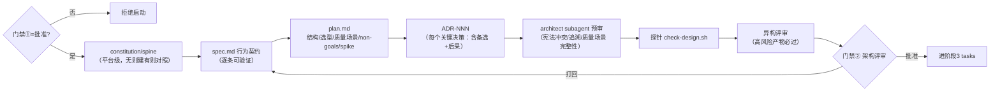

# 阶段 2 定义：定义/设计（Design）

> 阶段定义包 v1 · 2026-07-31 · 六件套：本定义 + spec/plan/ADR 三模板 + e2e-design skill + architect subagent + check-design.sh 探针 + 名词
> 参考标准：[MADR/Nygard ADR](https://adr.github.io/madr/) · [ATAM 质量场景](https://www.sei.cmu.edu/documents/2021/2003_004_001_14150.pdf) · [ISO/IEC/IEEE 42010](https://quality.arc42.org/standards/iso-42010)（视点/关注点）· [Design Doc/RFC](https://newsletter.pragmaticengineer.com/p/software-engineering-rfc-and-design)（goals/non-goals/alternatives）· arc42/C4 · Architecture Spine（BMAD 教训）· fitness functions（演进式架构）· spec-kit constitution/plan

## 0. 方法论 MECE 全景（设计阶段的完整维度分解）

| # | 决策问题（互斥） | 覆盖它的方法论 | 本平台采纳 | 归属 |
|---|---|---|---|---|
| G1 | **系统长什么样**（结构描述） | C4（Context/Container 起步）· arc42 · Spine ≤300 行 · ISO 42010 视点=按利益方关注点组织视图 | `docs/architecture/spine.md`（as-is 主干）+ spec 结构段（Mermaid 即代码） | 阶段2 |
| G2 | **行为长什么样**（可测规格） | Design Doc "the actual design" · 契约式表述 | `spec.md`：组件行为契约逐条可验证（探针可测句式） | 阶段2 |
| G3 | **为什么这么选**（决策留痕） | [MADR](https://ozimmer.ch/practices/2022/11/22/MADRTemplatePrimer.html)（context/options+pros-cons/decision/consequences）· RFC alternatives considered | `docs/architecture/adr/ADR-NNN.md`：一事一文、不可变只追加、**必含被否备选** | 阶段2 起，贯穿 |
| G4 | **质量怎么权衡**（tradeoff） | [ATAM](https://cio-wiki.org/wiki/Architecture_Tradeoff_Analysis_Method_(ATAM))：质量场景（刺激→响应→度量）、敏感点/权衡点 | `plan.md` 质量场景段：NFR→场景→设计应对→牺牲了什么 | 阶段2 |
| G5 | **不设计什么**（non-goals） | RFC goals/non-goals · YAGNI/Simplicity | `plan.md` non-goals 段（承 PRD Won't 再加设计级排除） | 阶段2 |
| G6 | **会不会烂掉**（架构可持续） | fitness functions · Spine 防腐（≤300 行随 PR 改）· 文档=代码同 PR | fitness fn 清单进 plan → M3 落 CI；spine 行数探针 | 阶段2 定义→M3 执行 |
| G7 | **违反宪法吗**（原则一致性） | spec-kit constitution · architect 预审 | `docs/constitution.md`（平台级一次性）+ architect subagent 预审 checklist | 阶段2 |
| G8 | **可行吗**（feasibility） | spike/PoC · 风险驱动 | `plan.md` 风险与 spike 段：高不确定项列 spike 任务（进 tasks，时间盒） | 阶段2 识别→阶段3 验证 |
| G9 | **对上需求了吗**（追溯延续） | ISO 29148 traceable（承 R6） | spec 章节回填 PRD 追溯表"下游"列；孤儿设计=红旗 | 贯穿 |

**MECE 检验**：ISO 42010 关注点→G1；Design Doc 四段→G2/G3/G5；ATAM→G4；MADR→G3；fitness→G6；constitution→G7；spike→G8；traceable→G9。八流派无孤儿字段。互斥边界：G3 记"选了什么为什么"，G4 记"质量间怎么让步"——决策 vs 权衡分离；G1 静态结构 vs G2 动态行为。

## 1. 阶段卡

| 项 | 内容 |
|---|---|
| 目的 | 把已批需求变成**可实现、可验证、决策留痕、宪法一致**的设计 |
| 入口条件 | `prd.md` 门禁① `决定：批准`（skill 第 0 步硬校验） |
| 主制品 | `specs/<feature>/spec.md` + `specs/<feature>/plan.md` + `docs/architecture/adr/ADR-NNN-*.md`（增量）；平台级一次性：`docs/constitution.md`、`docs/architecture/spine.md` |
| 出口 = 门禁② | **架构评审**：architect subagent 预审 → **异构评审**（高风险产物，选择性评审矩阵）→ 探针绿 → 人批 |
| 反模式警戒 | 把需求复述当设计；ADR 无备选（"决定"而非"决策"）；理想架构脱离 as-is；spine 膨胀；spike 无时间盒 |
| 负责 skill | `e2e-design`（`.claude/skills/e2e-design/`）+ `architect` subagent（`.claude/agents/architect.md`） |

## 2. 阶段内流程



## 3. 目录与命名

```text
specs/<feature>/
├── prfaq.md / prd.md      # 上游（门禁⓪①）
├── spec.md                # 行为契约（含门禁②记录块——三制品共用一块，记在 spec 尾）
└── plan.md                # 技术方案
docs/
├── constitution.md        # 工程宪法（平台级一次性，CLAUDE.md @import）
└── architecture/
    ├── spine.md           # 架构主干 as-is（≤300 行，随 PR 演进）
    └── adr/ADR-NNN-<slug>.md   # 三位编号连续，不可变只追加（superseded 也不删）
```

## 4. skill 与 agent 规格（实现于 .claude/）

**e2e-design skill**：第 0 步硬校验门禁①；产出顺序 constitution/spine（缺则建）→ spec → plan → ADR；每个"值得留痕的决策"必出 ADR 且必含 ≥2 备选；预审+探针绿后**先异构评审再请人批**（高风险产物不许跳过异构评审——选择性评审矩阵）；越门禁写 tasks/代码一律拒绝。
**architect subagent**（只读工具）：预审五查——①宪法逐条对照 ②spec 可验证性抽查 ③PRD 追溯完整性 ④质量场景是否覆盖全部 NFR ⑤ADR 备选是否真实（非稻草人）。输出结构化意见（阻断项/建议项），不改文件。

## 5. 名词表（阶段2 词条，已并入 docs/glossary.md）

ADR/MADR · 备选方案（alternatives considered）· 质量场景（刺激→响应→度量）· 权衡点/敏感点 · 视点（ISO 42010）· non-goals · spike（时间盒探索）· Architecture Spine · 稻草人备选 · 决策 vs 决定
