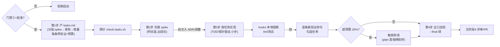

# 阶段 3 定义：构建与交付（Implement）

> 阶段定义包 v1 · 2026-07-31 · 六件套：本定义 + tasks 模板 + e2e-implement skill + check-tasks.sh 探针 + 名词 + 目录约定
> 参考标准：spec-kit tasks · TDD（红绿重构）· Definition of Done · Spotify Stop hook 实证 · 任务=可验证工作单元（宪法 C2）
> 口径：**tasks 产出归本 skill 第 1 步**（无独立 tasks skill，见 docs/process/skills-manifest.md）

## 0. 方法论 MECE 全景（构建阶段的完整维度分解）

| # | 决策问题（互斥） | 覆盖它的方法论 | 本平台采纳 | 归属 |
|---|---|---|---|---|
| I1 | **拆成什么任务**（工作分解） | spec-kit tasks · WBS · 垂直切片（vertical slice） | tasks.md：每条 = 一个可独立验证的工作单元，映射 SPEC-N | 阶段3 |
| I2 | **每条怎么算完**（完成判据） | DoD · 宪法 C2 可执行验证 | 每条任务强制 `验证：` 行（命令或可观测判据），无验证行=探针拒绝（SPEC-21） | 阶段3 |
| I3 | **按什么顺序做**（依赖与风险序） | 风险驱动（spike 先行）· 纵向骨架优先 | tasks 分组：spike → 骨架 → 增量；组内标依赖 | 阶段3 |
| I4 | **怎么写代码**（实现纪律） | TDD 红绿重构 · 小步提交 | 有测试栈时先写测试；无测试栈（文档/脚本类）用探针替代测试位 | 阶段3 |
| I5 | **写完谁拦**（本地门禁） | Spotify Stop hook · PostToolUse lint | hooks 承接（SPEC-15/16）；本阶段只负责触发，不负责定义 | 阶段3 执行 |
| I6 | **失控怎么办**（熔断执行） | Shape Up appetite · 砍线 · [CAT 复杂度分档](https://larridin.com/developer-productivity-hub/developer-productivity-benchmarks-2026) · DORA 2025 rework rate | **复杂度点（1/3/8）标难度不设产能上限；熔断信号=返工次数**——任务验证连续失败 3 次 / spike 超时间盒无结论 → 触发 plan 砍线（ADR-012：AI 执行下人类工时失去校准意义） | 阶段3 |
| I7 | **做完了吗**（阶段出口） | DoD 集合级 | 全任务勾选 + 探针绿 + 无未决 spike；出口非人审门禁（③在 PR 侧） | 阶段3 出口 |
| I8 | **评审与合并** | — | **移交阶段4**（e2e-review + 门禁③服务端） | 移交 |

**MECE 检验**：spec-kit tasks→I1/I2；TDD→I4；DoD→I2/I7；hooks 实证→I5；appetite→I6；评审合并显式移交 I8。互斥边界：I2 是"单条完成"，I7 是"整批完成"；I5 本地拦截 vs I8 服务端拦截。

## 1. 阶段卡

| 项 | 内容 |
|---|---|
| 目的 | 把已批设计变成**逐条可验证**的任务并实现，本地门禁挡住不合格产出 |
| 入口条件 | `spec.md` 门禁② `决定：批准`（skill 第 0 步硬校验） |
| 主制品 | `specs/<feature>/tasks.md` + 代码与测试 |
| 出口 | 全任务勾选 + `check-tasks.sh --final` 绿 + spike 全结论 → 交阶段4（评审/PR，门禁③） |
| 反模式警戒 | 任务无验证方式（"完成 X 功能"）；一条任务跨多个 SPEC 无法独立验证；spike 无结论就往下做；超预算不砍范围 |
| 负责 skill | `e2e-implement`（`.claude/skills/e2e-implement/`） |

## 2. 阶段内流程



## 3. 目录与命名

```text
specs/<feature>/
├── spec.md / plan.md      # 上游（门禁②）
└── tasks.md               # 阶段3 主制品（任务清单+验证+预算+勾选状态）
```

## 4. skill 规格：e2e-implement

- 触发："实现 / 开工 / tasks / e2e implement"
- 第 0 步校验门禁②；第 1 步产 tasks.md（每条：编号/描述/映射 SPEC/验证命令/预算小时/依赖）；第 2 步 spike 优先；第 3 步实现并逐条跑验证勾选；第 4 步出口自检
- 硬约束：无 `验证：` 的任务不许写进 tasks；spike 未出结论不得开始其依赖任务；超预算 20% 必须停下报告并按 plan 砍线（不静默超支）；不越门做评审/PR（阶段4）

## 5. 名词表（阶段3 词条，已并入 glossary）

任务验证行 · 垂直切片 · 纵向骨架 · DoD · 时间盒 spike 结论 · 预算超支砍线
