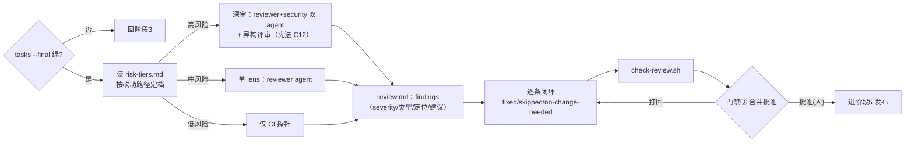

# 阶段 4 定义：评审与合并（Review）

> 阶段定义包 v1 · 2026-07-31 · 六件套：本定义 + review-record 模板 + e2e-review skill + check-review.sh 探针 + reviewer/security agents + 名词
> 参考标准：[SmartBear 2500 次评审研究](https://smartbear.com/learn/code-review/best-practices-for-peer-code-review/)（200-400 LOC 上限、检查表提效）· [OWASP Secure Code Review](https://cheatsheetseries.owasp.org/cheatsheets/Secure_Code_Review_Cheat_Sheet.html) · [风险分级路由](https://www.codeant.ai/blogs/prevent-ai-code-review-overload) · CODEOWNERS · 本平台宪法 C12/C14

## 0. 方法论 MECE 全景（评审阶段的完整维度分解）

| # | 决策问题（互斥） | 覆盖它的方法论 | 本平台采纳 | 归属 |
|---|---|---|---|---|
| V1 | **审什么**（缺陷类型分类） | 评审检查表（[检查表提效 66.7%](https://www.augmentcode.com/guides/code-review-checklist-40-questions-before-you-approve)）· 缺陷分类学 | 五类 finding：correctness / security / contract（违反 spec/宪法）/ maintainability / test-gap | 阶段4 |
| V2 | **审多深**（强度分档） | 风险分级路由 · CODEOWNERS · SmartBear 200-400 LOC 上限 | `risk-tiers.md` glob 路由：高风险=深审+强制人审+异构；中=单 lens；低=CI 绿即可 | 阶段4 |
| V3 | **谁来审**（评审主体） | 多 agent 窄职责（Anthropic 实践）· 人机分工 | reviewer（正确性/契约）+ security（安全）双 agent 内环；人审在门禁③ | 阶段4 |
| V4 | **怎么算过**（阻断判据） | severity 阈值 · required checks · [调研 v2 三通道契约](../../research/AI时代评审门禁-调研.md) | **三通道互不重叠**：①确定性阻断（探针/lint/测试/SAST，唯一 blocker 来源，**LLM 不得单独解除**）②LLM 分诊（对确定性告警出 `likely-FP` **建议**，解除须人审）③LLM 自主发现（**默认 advisory**，经 shadow 验证 precision 达标才可升阻断） | 阶段4 |
| V4b | **工具失灵怎么办**（失效语义） | fail-closed 原则 · 非确定性实测 | 超时/解析失败/部分未审**不得视为零 finding**；高风险 fail-closed；记录模型+prompt hash，同 diff 缓存结果**禁止重跑到过** | 阶段4 |
| V5 | **谁批准**（授权归因） | 宪法 C14（不得自批）· 分支保护 approver≠author | 试点：人类署名；企业：服务端 review 事件（ADR-009） | 阶段4 出口=门禁③ |
| V6 | **分歧怎么办**（评审争议） | 辩论矩阵（本平台 M0 实证）· 异构评审 | 高风险制品：意见逐条 accept/partial/refute 留痕；refute 须给反证 | 阶段4 |
| V7 | **改完谁复核**（闭环） | re-review · 修复验证 · 审计状态机 | 状态机 `open → fixed / false-positive / accepted-risk → reopened`；每条带 ID+diff SHA+验证证据+审批 actor+时间；后两态须**独立人类**署名理由+到期日+跟踪票据；**安全 critical 禁止 accepted-risk**；block 未闭环不得过门禁③ | 阶段4 |
| V7b | **人怎么不被 AI 带偏**（注意力保护） | HN 实证：AI 摘要锚定注意力 | 高风险路径人审**先独立判断再看 AI 摘要**（顺序不可颠倒）；评审 agent 与生成 agent 异构隔离（同源有相关盲区） | 阶段4 |
| V8 | **发布与运维** | — | **移交阶段5**（e2e-release，门禁④） | 移交 |

**MECE 检验**：SmartBear 检查表→V1/V2；OWASP 安全清单→V1（security 类）+V3；风险路由/CODEOWNERS→V2/V3；宪法 C12→V2/V6，C14→V5；DORA rework→V7。互斥边界：V1 是"审的内容"，V2 是"审的力度"，V4 是"过不过"，V5 是"谁说了算"。

## 1. 阶段卡

| 项 | 内容 |
|---|---|
| 目的 | 用**分档**的评审强度拦住不合格产出，且评审本身可审计 |
| 入口条件 | `tasks.md` 全勾选 + `check-tasks.sh --final` 绿（阶段3 出口） |
| 主制品 | `specs/<feature>/review.md`（findings + 闭环状态 + 辩论矩阵） |
| 出口 = 门禁③ | **合并批准**：确定性 blocker 全闭环 + CI required checks 绿 + 按风险档完成人审（approver≠author，服务端事件为准） |
| 反模式警戒 | 一次审 400+ 行（[Google 更严：100 行合理/1000 行过大，文件分散度独立计](https://google.github.io/eng-practices/review/developer/small-cls.html)）；所有 PR 同等力度；AI 自批（违宪 C14）；finding 提了不闭环；**让 LLM 解除确定性告警**（调研 v2 抓出的最危险设计）；**把大厂配置卖给起步级团队**（噪音会让整套门禁被关掉） |
| 实施分级 | **起步级**（无 SAST/无遥测）：lint+test+secret scan 阻断，AI 全 advisory｜**成长级**：加 SAST 阻断 + 结构化闭环 + 抽样标注攒 precision 数据｜**成熟级**：才启用风险模型/百分位/经验证的 AI 阻断权 |
| 负责 skill | `e2e-review` + `reviewer`/`security` agents |

## 2. 阶段内流程



## 3. 目录与命名

```text
specs/<feature>/review.md      # 阶段4 主制品（含门禁③记录块）
docs/process/risk-tiers.md     # 风险分级路由表（本身列为高风险路径，改动须人审）
.claude/agents/{reviewer,security}.md
```

## 4. skill 与 agent 规格

**e2e-review**：第 0 步校验阶段3 出口（tasks `--final` 绿）；按 risk-tiers 定档；**先跑确定性探针（通道①）再跑 agent（通道②③）**；逐条闭环；探针绿后停门禁③。**不得自行填写批准**（宪法 C14）；**不得因 agent 说"这是误报"而放行确定性 blocker**。
**reviewer agent**（只读）：correctness / contract（对照 spec.md 的 SPEC-N 与宪法）/ maintainability / test-gap 四类。
**security agent**（只读）：OWASP 导向——认证授权、输入校验、密钥与数据外发、供应链（宪法 C15）、权限边界（Tier 2 盲区，arXiv 2604.04978）。

## 5. 名词表（阶段4 词条，已并入 glossary）

finding 五类 · severity 三档 · 风险分档路由 · 闭环状态 · approver≠author · 评审规模上限 · 辩论矩阵
