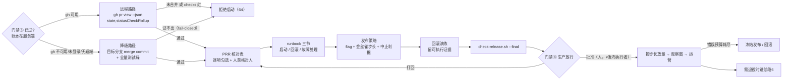

# 阶段 5 定义：发布与运营（Release & Operate）

> 阶段定义包 v1 · 2026-07-31 · 六件套：本定义 + release/runbook 模板 + e2e-release skill + check-release.sh 探针 + 目录约定 + 名词
> 参考标准：[Google SRE 生产就绪评审 PRR](https://sre.google/sre-book/evolving-sre-engagement-model/) · [SRE 发布协调工程 LCE](https://sre.google/sre-book/reliable-product-launches/) · [SLO 实施](https://sre.google/workbook/implementing-slos/) · [错误预算策略](https://sre.google/workbook/error-budget-policy/) · [金丝雀发布](https://martinfowler.com/bliki/CanaryRelease.html) · [Feature Toggles](https://martinfowler.com/articles/feature-toggles.html) · [Parallel Change（expand/contract）](https://martinfowler.com/bliki/ParallelChange.html) · [DORA 四指标](https://dora.dev/guides/dora-metrics-four-keys/) · [无责 postmortem](https://sre.google/sre-book/postmortem-culture/) · 本平台 ADR-009/ADR-013、宪法 C2/C3/C13/C14

## 0. 方法论 MECE 全景（发布/运营阶段的完整维度分解）

| # | 决策问题（互斥） | 覆盖它的方法论 | 本平台采纳 | 归属 |
|---|---|---|---|---|
| R0 | **入口怎么验**（上游门禁③ 不在文件里） | ADR-009 权威载体分级 · ADR-013 · 宪法 C3（安全边界只认服务端） | **双路径校验**：远程有 `gh` → `gh pr view --json state,statusCheckRollup` 验 PR=MERGED 且 checks 无红；`gh` 不可用/未登录/无远端 → **降级**为目标分支有 merge commit + 全量测试绿。两条都证不出=**fail-closed 不放行**（不是报错跳过） | 阶段5 第0步 |
| R1 | **能不能发**（生产就绪判据） | [Google SRE PRR](https://sre.google/sre-book/evolving-sre-engagement-model/)（容量/依赖/监控/故障模式/演练逐项过）· 发射检查表 | `release.md` **PRR 核对表**：逐项勾选 + **人类核对人**（SPEC-22；核对人写 agent/AI 即违宪 C14） | 阶段5 |
| R2 | **怎么发**（放量与暴露面） | **部署 ≠ 发布**（feature flag 把二者解耦）· [金丝雀](https://martinfowler.com/bliki/CanaryRelease.html) · 蓝绿 · 渐进交付 | 发布策略段：flag 名与默认值（默认关）+ 金丝雀步长与每档观察时长 + **中止判据写成指标阈值**（不看"感觉还行"） | 阶段5 |
| R3 | **谁协调**（跨团队发射） | [Google LCE 发布协调工程](https://sre.google/sre-book/reliable-product-launches/)（发射清单 + 协调人 + 冻结窗口） | 发布窗口/依赖方/通告对象记入 release.md；单人试点退化为自检清单，**但依赖方一栏不许写"无"而不核** | 阶段5 |
| R4 | **挂了怎么退**（回滚可行性） | 回滚预案 · [Parallel Change expand/contract](https://martinfowler.com/bliki/ParallelChange.html)（不可逆点识别）· DORA 失败部署恢复时间 | 回滚预案表：触发判据 / **可执行回滚命令** / 预期 RTO / **不可逆点**；外加 **回滚演练证据**——没演练过的回滚预案是纸面预案 | 阶段5 |
| R5 | **怎么知道好不好**（可观测与 SLO） | [SLI/SLO/错误预算](https://sre.google/workbook/implementing-slos/) · 四黄金信号 | SLO 表：SLI / 目标 / 错误预算 / 告警规则 / **该告警指向 runbook 的哪一小节**（没接线的 SLO 只是 PPT） | 阶段5 |
| R6 | **出事谁怎么处理**（值班第一现场） | runbook · on-call · 事故响应 | `docs/runbooks/<feature>.md`：**启动 / 回滚 / 故障处理三节非空**（SPEC-22），面向"凌晨三点被叫醒的人"——命令可复制、判据可观测 | 阶段5 |
| R7 | **谁放行生产**（授权归因） | 轻量变更管理 · 宪法 C14 · ADR-009 分级 | 门禁④：**人类署名且 ≠ 发布执行者**；企业模式以服务端事件为权威账本，制品块降为可读投影 | 阶段5 出口=门禁④ |
| R8 | **发完看什么**（观察窗与运营） | [错误预算策略](https://sre.google/workbook/error-budget-policy/) · [无责 postmortem](https://sre.google/sre-book/postmortem-culture/) · DORA 变更失败率 | 观察窗结论回写 release.md；预算耗尽→冻结发布/回滚；事故引出的改动**回门禁⓪立项**（宪法 C8 紧急通道：先动手，48h 内补票） | 阶段5 |
| R9 | **退役** | — | **移交阶段6**（e2e-retire，门禁⑤） | 移交 |

**MECE 检验**：PRR→R1；LCE 发射清单→R3（协调）与 R1（判据），两者按"谁负责 vs 判什么"切开；金丝雀/flag→R2；回滚与 expand-contract→R4；SLO/错误预算→R5 与 R8，按"发布前定义 vs 发布后消费"切开；runbook→R6；C14→R7；ADR-009→R0。互斥边界：R1 是"发之前算不算准备好"，R2 是"用什么姿势暴露给用户"，R4 是"错了怎么退"，R5 是"怎么看出错了"——判据 / 姿势 / 退路 / 观测四者不重叠。

## 1. 阶段卡

| 项 | 内容 |
|---|---|
| 目的 | 把已合并的改动**安全地**送进生产，并留下"出事有人能处理"的运营资产 |
| 入口条件 | 门禁③（**账本在服务端**，SPEC-2 对其显式豁免文本块）：远程路径 `gh pr view --json state,statusCheckRollup` = MERGED 且 checks 无红；本地降级路径 = 目标分支 merge commit + 全量测试绿。skill 第 0 步硬校验，证不出即拒绝启动 |
| 主制品 | `specs/<feature>/release.md`（PRR 核对记录 + 发布策略 + 回滚预案 + SLO + 观察窗）+ `docs/runbooks/<feature>.md`（启动/回滚/故障三节非空） |
| 出口 = 门禁④ | **生产放行**：PRR 项全勾选且各有人类核对人 + runbook 三节非空 + 回滚演练证据 + `check-release.sh --final` 绿 → 人批（批准人 ≠ 发布执行者） |
| 反模式警戒 | 把"部署"当"发布"（无 flag，代码上线即全量暴露）；无回滚预案就上线；回滚预案从未演练；runbook 写"联系张三"（人一走就失效）；PRR 自己勾自己（违宪 C14）；SLO 定了但没接告警；金丝雀直接全量不设观察窗；把 `gh` 不可用当成"门禁③ 免检" |
| 实施分级 | **起步级**（无 flag 平台/无 SLO 体系）：手动发布 + 可执行回滚脚本 + runbook 三节 + 日志兜底｜**成长级**：feature flag + 金丝雀步长 + SLO 告警接 runbook｜**成熟级**：自动中止/自动回滚 + 错误预算策略（预算耗尽自动冻结发布） |
| 负责 skill | `e2e-release`（`.claude/skills/e2e-release/`） |

## 2. 阶段内流程



## 3. 目录与命名

```text
specs/<feature>/
├── review.md              # 上游（阶段4）；门禁③账本在服务端，本文件只是可读投影
└── release.md             # 阶段5 主制品（PRR 核对 + 策略 + 回滚 + SLO + 门禁④记录块）
docs/runbooks/<feature>.md # 值班第一现场文档：启动/回滚/故障三节非空（SPEC-22 硬契约）
```

命名约定：runbook 文件名 = `specs/` 下的 feature 目录名，探针据此定位（`docs/runbooks/$(basename <feature-dir>).md`），不许另起别名。

## 4. skill 规格：e2e-release

- 触发："发布 / 上线 / release / 生产放行 / 写 runbook / e2e release"
- 第 0 步双路径校验门禁③（远程优先，降级不报错但**降级失败即拒绝**）；第 1 步 PRR 核对表逐项过（每项要证据要核对人）；第 2 步写 runbook 三节；第 3 步发布策略与回滚预案 + **实跑一次回滚演练**；第 4 步 `--final` 探针绿后停门禁④等人批
- 硬约束：不得自行填写门禁④（宪法 C14）；不得把核对人填成 agent/AI；无可执行回滚命令不许申请放行（宪法 C2）；`gh` 不可用只是换路径**不是免检**；放量与观察窗结论必须回写 release.md

## 5. 名词表（阶段5 词条，待并入 `docs/glossary.md`）

PRR（生产就绪评审）· LCE（发布协调工程）· 部署≠发布 · feature flag（默认关）· 金丝雀步长 · 中止判据 · 回滚 RTO · 不可逆点（expand/contract）· 纸面预案（未演练的回滚预案）· SLI/SLO/错误预算 · 错误预算策略 · 告警接线（告警→runbook 小节）· runbook 三节 · 观察窗 · 无责 postmortem · 门禁③双路径校验（远程 gh / 本地降级）
