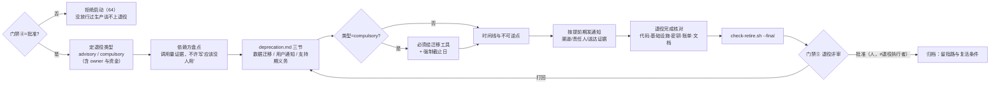

# 阶段 6 定义：退役（Retire / Deprecate）

> 阶段定义包 v1 · 2026-07-31 · 六件套：本定义 + deprecation 模板 + e2e-retire skill + check-retire.sh 探针 + 目录约定 + 名词
> 参考标准：[Google SWE book Ch.15 Deprecation](https://abseil.io/resources/swe-book/html/ch15.html)（advisory / compulsory 两型、"deprecation 要有 owner 与资金"）· [EU CRA 法规 (EU) 2024/2847](https://eur-lex.europa.eu/eli/reg/2024/2847/oj)（支持期内的安全更新义务）· [GDPR Art.17 删除权](https://gdpr-info.eu/art-17-gdpr/) 与 Art.5(1)(e) 存储限制 · [RFC 8594 Sunset HTTP Header](https://www.rfc-editor.org/rfc/rfc8594.html)（机器可读的退役通知）· 本平台宪法 C2/C8/C14/C15

## 0. 方法论 MECE 全景（退役阶段的完整维度分解）

| # | 决策问题（互斥） | 覆盖它的方法论 | 本平台采纳 | 归属 |
|---|---|---|---|---|
| D0 | **入口怎么验**（上游门禁④） | 宪法 C1 门禁串锁 · ADR-009 | skill 第 0 步 `gate_require release.md 批准`；未放行过生产的东西谈不上退役（退出码 64）。deprecation 计划正文还须**显式引用门禁④记录**（SPEC-23） | 阶段6 第0步 |
| D1 | **该不该退**（退役决策） | 用量/成本/替代方案评估 · Google SWE book："deprecation 是**有成本的项目**，没有 owner 与预算必然烂尾" | 退役类型段写明 **owner 与资金**；重大退役本身要先走门禁⓪立项（宪法 C8，不许"顺手下线"） | 阶段6（决策可上溯门禁⓪） |
| D2 | **哪种退法**（退役强度） | [Google SWE book 两型](https://abseil.io/resources/swe-book/html/ch15.html)：**advisory**（建议性，无强制期限，靠自愿迁移）/ **compulsory**（强制，有截止日 + **迁移工具** + 推动人） | `- 类型：advisory \| compulsory` 二选一，探针枚举校验；**选 compulsory 就必须给迁移工具与强制截止日**——只发公告不给工具＝把成本甩给用户，实践中等于永不完成 | 阶段6 |
| D3 | **谁受影响**（依赖方盘点） | 引用图/调用方清单 · deprecation warning 埋点 · 遥测证明"真的没人用了" | 依赖方盘点表：依赖方 / 调用量证据 / 迁移目标 / 联系人 / 迁移状态；**"应该没人用"不算证据**（宪法 C2） | 阶段6 |
| D4 | **数据怎么办**（迁移/归档/销毁） | 数据迁移三态 · GDPR 存储限制与删除权 · 可逆窗口 · 对账校验 | 数据迁移段（**非空硬契约**）：每条数据集标处置（迁移/归档/销毁）+ **校验方式**（对账命令或判据）+ 可逆窗口 + 责任人；备份与回退写死 | 阶段6 |
| D5 | **怎么通知**（用户通知） | 提前期（advance notice）· 多渠道送达 · 文档标 deprecated · [RFC 8594 Sunset 头](https://www.rfc-editor.org/rfc/rfc8594.html) · 运行时 deprecation warning | 用户通知段（**非空硬契约**）：渠道 / 时点（提前期）/ 内容要点 / **责任人** / 送达证据；能机器可读的接口用 Sunset 头 + 运行时告警，不只靠邮件 | 阶段6 |
| D6 | **还要支持多久**（支持期法定义务） | [EU CRA (EU) 2024/2847](https://eur-lex.europa.eu/eli/reg/2024/2847/oj)：支持期内须持续处置漏洞、提供安全更新，**默认 ≥5 年**（产品预期寿命更短时以寿命为准；主要义务自 2027-12-11 适用）· 合同 SLA · LTS 政策 | 支持期义务段（**非空硬契约**）：义务 / 起 / **止（须为具体日期）** / 覆盖范围（通常仅安全修复）/ 依据（合同·法规·LTS）/ 责任人；口头承诺不可审计＝探针拒绝 | 阶段6 |
| D7 | **什么时候不能回头**（时间线与不可逆点） | 阶段化 sunset 时间线 · 不可逆点识别（承阶段5 R4 同一概念） | 时间线表逐里程碑标"是否不可逆 + 回退方案"；越过不可逆点只能前滚，须在门禁⑤ 前说清 | 阶段6 |
| D8 | **怎么算退干净**（完成判据） | 僵尸服务治理 · FinOps 成本归零 · 宪法 C15 最小权限 | 退役完成核对表（勾选 + 人类核对人）：代码与配置下线 / 基础设施·域名·证书回收 / **密钥与访问权限吊销**（C15）/ 账单归零 / 文档标 retired 并留指路 | 阶段6 |
| D9 | **谁批准退役**（授权归因） | 宪法 C14（执行者不得自批）· ADR-009 分级 | 门禁⑤ 退役评审：人类署名且 ≠ 退役执行者；企业模式以服务端事件为权威账本 | 阶段6 出口=门禁⑤ |

**MECE 检验**：Google SWE book Ch.15→D1（成本与 owner）/D2（两型）/D3（遥测证明）；EU CRA→D6；GDPR→D4；RFC 8594→D5；FinOps 与 C15→D8；C14→D9。互斥边界：D2 是"用多大力气推"，D5 是"怎么让人知道"，D6 是"知道之后我们还欠他们什么"——强度 / 告知 / 义务三者不重叠；D4 管数据，D8 管基础设施与权限，同为"清理"但对象不同、校验方式不同。

## 1. 阶段卡

| 项 | 内容 |
|---|---|
| 目的 | 让一个系统/功能**有序消失**：用户有去处、数据有交代、法定义务有兜底、资源不留僵尸 |
| 入口条件 | `release.md` 门禁④ `决定：批准`（skill 第 0 步硬校验，退出码 64）；deprecation 计划正文须引用该门禁④记录（SPEC-23） |
| 主制品 | `specs/<feature>/deprecation.md`：**数据迁移 / 用户通知 / 支持期义务三节非空** + 退役类型（advisory·compulsory）+ 依赖方盘点 + 时间线与不可逆点 + 退役完成核对 |
| 出口 = 门禁⑤ | **退役评审**：三节非空 + 支持期有具体到期日 + compulsory 型有迁移工具与强制截止日 + 完成核对全勾选 + `check-retire.sh --final` 绿 → 人批（≠ 退役执行者） |
| 反模式警戒 | 只发公告不给迁移工具（把 compulsory 当 advisory 用，退役永不完成）；支持期口头承诺无到期日；删数据前无备份/无对账校验；退役后忘记吊销密钥与关账单（僵尸成本 + 供应链面，违 C15）；"应该没人用了"当依赖方盘点；无 owner 的退役计划（Google 的一手教训：deprecation 没有资金就没有终点） |
| 实施分级 | **起步级**：advisory + 文档标记 + 依赖方清单｜**成长级**：compulsory + 迁移工具 + Sunset 头/运行时告警 + 对账校验｜**成熟级**：遥测驱动（调用量归零才允许下线）+ 自动化清理与成本归零核验 |
| 负责 skill | `e2e-retire`（`.claude/skills/e2e-retire/`） |

## 2. 阶段内流程



## 3. 目录与命名

```text
specs/<feature>/
├── release.md             # 上游（门禁④记录块所在；本阶段第 0 步据此串锁）
└── deprecation.md         # 阶段6 主制品（三节非空 + 门禁④引用 + 门禁⑤记录块）
docs/runbooks/<feature>.md # 退役期间仍是值班现场文档，退役完成后随文档一起标 retired
```

## 4. skill 规格：e2e-retire

- 触发："退役 / 下线 / 弃用 / deprecate / sunset / e2e retire"
- 第 0 步硬校验门禁④；第 1 步定类型（advisory/compulsory）与 owner；第 2 步依赖方盘点（要调用量证据）；第 3 步写三节（数据迁移含校验方式 / 用户通知含责任人与送达证据 / 支持期义务含具体到期日与法规依据）；第 4 步时间线与不可逆点；第 5 步完成核对与 `--final` 探针；第 6 步停门禁⑤等人批
- 硬约束：不得自行填写门禁⑤（宪法 C14）；compulsory 型无迁移工具/无截止日一律拒绝；支持期无具体日期一律拒绝；删除类数据处置无备份与对账校验一律拒绝；退役完成核对必须覆盖密钥吊销与账单归零（宪法 C15）

## 5. 名词表（阶段6 词条，待并入 `docs/glossary.md`）

advisory deprecation（建议性退役）· compulsory deprecation（强制退役）· 迁移工具（codemod/脚本）· deprecation owner 与资金 · 依赖方盘点 · 调用量证据 · 数据处置三态（迁移/归档/销毁）· 对账校验 · 可逆窗口 · 提前期（advance notice）· Sunset 头（RFC 8594）· 支持期义务（EU CRA ≥5 年默认）· 不可逆点 · 僵尸服务 · 成本归零 · retired 指路（归档后指向替代方案）
