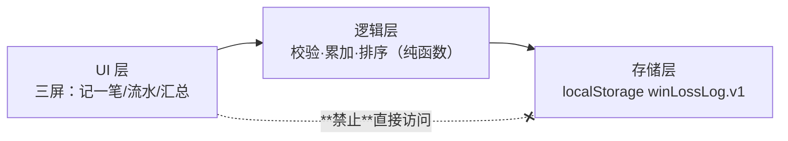

# PLAN：win-loss-log（技术方案）

> 阶段 2 产物 · 门禁②评审材料 · 2026-07-31 · 门禁②记录见 spec.md 尾部

## 结构

> 依赖方向断言（fitness function）：UI 层不得直接调 localStorage，必须经逻辑层——这是 SPEC-12 的分层 fitness function（依据 ADR-002）。

## 技术选型

| 选择 | 内容 | 依据 |
|---|---|---|
| 形态 | 单个 HTML（内联 CSS/JS） | SR-3；零构建零依赖 |
| 存储 | localStorage | prfaq 差异化（离线零账号）；接受清缓存即丢的权衡 |
| 金额 | **整数**，单位元 | 用户领域裁决：赌场筹码最小 5 元，无分 |
| 测试 | **抽 LAYER:LOGIC/STORE 块 → `new Function` 求值 → node 断言**（实测 node v24.12.0 可用；整块 eval 必炸故必须抽块） | ADR-002（本仓） |
| lint | `check-single-file.sh` 覆盖交付物；**ratchet 不覆盖 index.html**（内置 selfcheck 只扫 `*.sh`，硬挂上去是假绿——预审 #5） | ADR-002（本仓） |

## 质量场景（ATAM）

| NFR | 刺激 | 期望响应与度量 | 设计应对 | 牺牲了什么 |
|---|---|---|---|---|
| NFR-1 浏览器 | 用 Safari 打开 | 三屏可用 | 只用基础 DOM API，不用新特性 | 现代语法糖便利性 |
| NFR-2 零依赖 | 双击文件 | 直接可用，无安装 | 单文件内联 | 模块化与工程化便利 |
| NFR-3 规模 ≤400 行 | 加功能 | 超限 CI 红 | 功能封顶 3 步；**超限处置=按 prfaq 熔断砍序砍功能（先砍汇总页只留数字），不抬限** | 扩展性（刻意的） |
| NFR-4 隐私 | 检查网络 | 零请求 | 无外链 | CDN 带来的字体/图标 |

## Non-goals

- 不做构建/打包/模块化　- 不做框架（React/Vue）　- 不做 IndexedDB（localStorage 够用）　- 不做数据导出（Appetite 外）

## 风险与 spike

| 风险 | spike | 时间盒 | 失败即触发 |
|---|---|---|---|
| ~~macOS 无 node~~ **风险瞄错**（预审 A7）：node 实测存在 v24.12.0；真风险是"单文件里的逻辑能否被 node 加载" | D1：15 分钟内产出**可跑的抽块+断言最小样例**（抽 LAYER:LOGIC → new Function → 断言 netTotal） | 15 分钟 | 逻辑层改为独立可抽取形态（已是本设计） |

## Fitness Functions（入 demo 仓 CI）

| 断言 | 检查方式 | CI 步骤名（required check） |
|---|---|---|
| 单文件无外链（SPEC-10） | `scripts/check-single-file.sh` | `产品自审 · 单文件契约` |
| 总行数 ≤400（SPEC-11，`wc -l` 口径） | 同上脚本内 | 同上 |
| 分层：标记齐全+顺序正确（fail-closed）、LOGIC 块零 DOM/零 localStorage、localStorage 只在 STORE 块（SPEC-12） | 同上脚本内 **awk 区间判定**（plain grep 无区块作用域） | 同上 |
| 逻辑契约（SPEC-1~5/7/9） | `tests/logic.test.sh`（抽块 + node 断言） | `逻辑契约测试` |

> **ratchet 不列为本 feature 的 fitness function**：内置 selfcheck 只扫 `*.sh`，对交付物 `index.html` 零覆盖，挂上去会是结构性假绿（预审 #5）。产品文件由 `check-single-file.sh` 覆盖。

## CI 契约（宪法 C3：只有 required check 才是硬策略）

**required check 对应 job（check-run）而非 step**（异构评审 #11：原设计把产品门禁写成同一 job 内的 step，无法分别设 required）。故拆为四个独立 job：

| job 名（= required check 名） | 覆盖 | 阶段3 前行为 |
|---|---|---|
| `process-gates` | 阶段0-2 探针 + 平台自审 | 正常跑 |
| `probe-negatives` | 宪法 C13 可证伪性 | 正常跑 |
| `product-contract` | SPEC-10/11/12 单文件契约 | index.html 不存在时放行；**但 tasks.md 一旦存在（=进入阶段3）缺文件即 FAIL** |
| `logic-contract` | SPEC-1~5/7/9 逻辑测试 | 同上规则 |

分支保护须把这四个 job 全部登记为 required（服务端配置证据在门禁③留痕）。

## 里程碑

单一里程碑：三步骨架实现 + 逻辑测试 + CI 双环 + 六门禁留痕。
